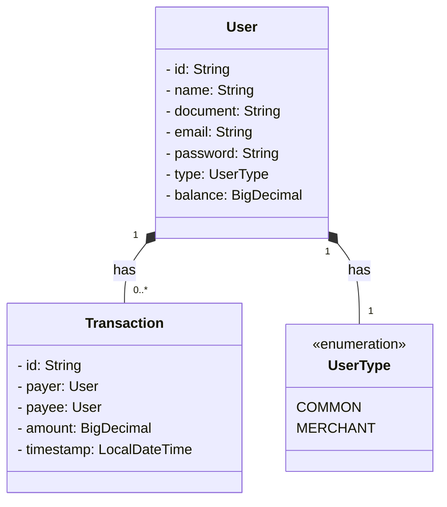

# Sistema de pagamentos simplificado

Implementação do desafio de projeto proposto no repositório: https://github.com/PicPay/picpay-desafio-backend

## Contexto

Existem dois tipos de usuários, os comuns e lojistas, ambos têm carteira com dinheiro e realizam transferências entre eles. Deve-se atentar somente ao fluxo de transferência entre dois usuários.

Requisitos:

- [x] Para ambos tipos de usuário, precisamos do Nome Completo, CPF, e-mail e Senha. CPF/CNPJ e e-mails devem ser únicos no sistema. Sendo assim, o sistema deve permitir apenas um cadastro com o mesmo CPF ou endereço de e-mail.

- [x] Usuários podem enviar dinheiro (efetuar transferência) para lojistas e entre usuários.

- [x] Lojistas só recebem transferências, não enviam dinheiro para ninguém.

- [x] Validar se o usuário tem saldo antes da transferência.

- [x] Antes de finalizar a transferência, deve-se consultar um serviço autorizador externo. Use um mock para simular.

- [x] A operação de transferência deve ser uma transação (ou seja, revertida em qualquer caso de inconsistência) e o dinheiro deve voltar para a carteira do usuário que envia.

- [x] No recebimento de pagamento, o usuário ou lojista precisa receber notificação (envio de email, sms) enviada por um serviço de terceiro e eventualmente este serviço pode estar indisponível/instável. Use um mock para simular o envio.

## Diagrama de classes

## Desenvolvimento

### Testes

Testes unitários e de integração nas camadas de service e controller (com o TestRestTemplate) utilizando JUnit e Mockito

### Documentação

Springdoc-openapi Swagger-ui endpoint:

http://localhost:8080/swagger-ui
