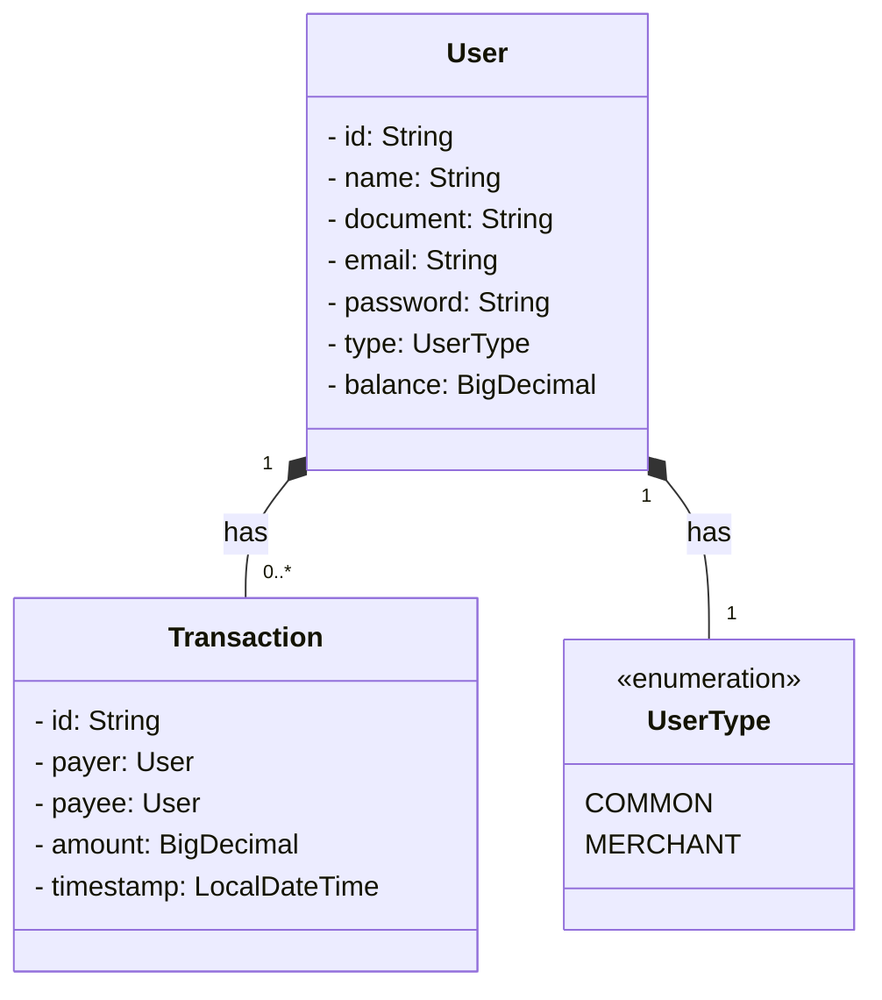

# Sistema de pagamentos simplificado

Implementação do desafio de projeto proposto no repositório: https://github.com/PicPay/picpay-desafio-backend

## Diagrama de classes

## Desenvolvimento

### Testes

Testes unitários e de integração nas camadas de service e controller (com o TestRestTemplate) utilizando JUnit e Mockito

### Documentação

Springdoc-openapi Swagger-ui endpoint:

http://localhost:8080/swagger-ui
